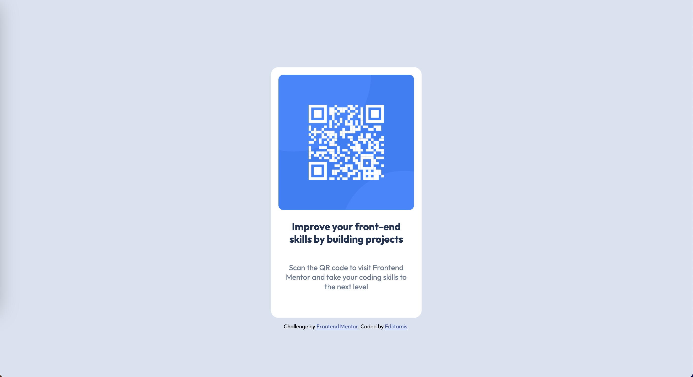

# Frontend Mentor - QR code component solution

This is a solution to the [QR code component challenge on Frontend Mentor](https://www.frontendmentor.io/challenges/qr-code-component-iux_sIO_H).

## Table of contents

- [Screenshots](#screenshots)
- [Links](#links)
- [Built with](#built-with)

## Screenshots
### Desktop 

### Mobile

## Links

- Live Site URL: [https://edlitamis.github.io/qr-code-component/](https://edlitamis.github.io/qr-code-component/)

## Built with

- Semantic HTML5 markup
- CSS custom properties
- Flexbox
